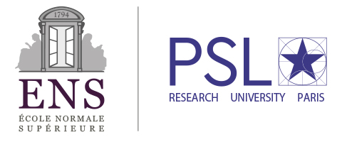

Welcome to the [CFM](https://www.cfm.fr/)-[ENS](http://www.ens.fr) Chaire "_Modèles et Sciences des Données_" of the [ENS](http://www.ens.fr/).

This chaire is organized around data sciences in a broad sense with the goal of bringing together researchers with diverse backgrounds (including for instance mathematics, computer science, physics, chemistry and neuroscience) but a common interest in dealing with large scale or high dimensional data.

The main activities of the chaire are:

- It organizes the monthly [Data Science Colloquium of the ENS](seminar/).
- It hosts the "_Laplace Junior Professor Chair in Data Science_" program, see the job [openings announcements](jobs/) for more details.
- It supports the [Challenge Data program](https://challengedata.ens.fr/en/home).

Scientific Committee
============================

- [Florent Krzakala](http://krzakala.org/) (ENS and UPMC): director ;
- [Stéphane Mallat](https://www.di.ens.fr/~mallat/) (ENS) ;
- [Gabriel Peyré](http://gpeyre.github.io/) (CNRS and ENS).
- ...

Thanks
===========================

