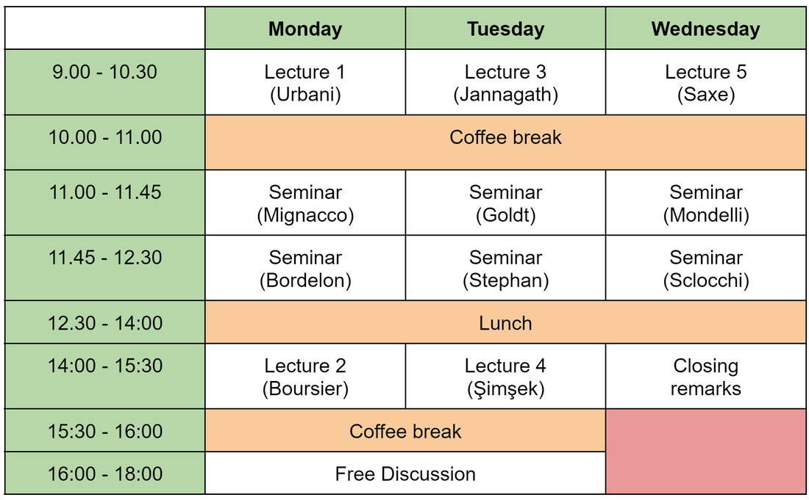

The [CFM](https://www.cfm.fr/)-[ENS](http://www.ens.fr) chair "_Modèles et Sciences des Données_" organize a [workshop on the challenges in the theory of neural networks dynamics](https://dynnnparis.weebly.com/).

The goal of the workshop is to bring together researchers from diverse backgrounds and institutions for an informal and open discussion on the most promising research directions in neural network dynamics. Our focus will be on the most significant challenges facing current research, as well as the main difficulties that need to be overcome to advance the field.

When
============================

23-25 October 2023.

Where
============================

Amphithéâtre Hermite at the [Institut Henri Poincaré](https://www.ihp.fr/fr), 11 rue Pierre et Marie Curie, 75231 Paris Cedex 05.

Speakers
============================

- ​[Blake Bordelon](https://blakebordelon.github.io/)  (Harvard University)
- [Etienne Boursier](https://eboursier.github.io/)  (INRIA Paris-Saclay)
- [Sebastian Goldt](https://datascience.sissa.it/research-unit/12/theory-of-neural-networks)  (SISSA)
- [Aukosh Jannagath](https://aukosh.github.io/)  (University of Waterloo)
- [Francesca Mignacco](https://biophysics.princeton.edu/people/francesca-mignacco)  (Princeton University)
- [Marco Mondelli](http://marcomondelli.com/)  (IST)
- [Andrew Saxe](https://www.saxelab.org/)  (UCL)
- [Berfin Simsek](https://www.bsimsek.com/)  (NYU)
- [Antonio Sclocchi](https://people.epfl.ch/antonio.sclocchi/?lang=en)  (EPFL)
- [Ludovic Stephan](https://www.lstephan.fr/)  (EPFL)
- [Pierfrancesco Urbani](https://www.ipht.fr/Pisp/pierfrancesco.urbani/)  (IPhT Saclay)

Schedule
============================

Organising committee
============================

- [Bruno Loureiro](https://brloureiro.github.io/) (ENS & CNRS)
- [Gabriele Sicuro](https://gabrielesicuro.wordpress.com/) (KCL)
- [Stefano Sarao](https://profiles.ucl.ac.uk/83951) (UCL)
